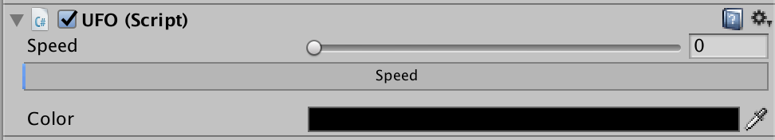

# 自定义Component

#### 制作一个Unity的Inspector界面中的Editor 操作组件

##### 制作过程
* 新建一个Inspector类, 下面给出一个Inspector类的简单样例

```C#
[CustomEditor(typeof(XX))]
public class xxEditor : Editor {
	public override void OnInspectorGUI() {
		var target = (XX)(serializedObject.targetObject);
		target.speed = EditorGUILayout.Slider("Speed", target.speed, 0, 100);
		ProgressBar(target.speed, "Speed");

		target.color = EditorGUILayout.ColorField("Color", target.color);
	}

	private void ProgressBar(float value, string label) {
		Rect rect = GUILayoutUtility.GetRect(20, 20, "TextField");
		EditorGUI.ProgressBar(rect, value, label);
		EditorGUILayout.Space();
	}
}
```

* 然后，我们只要把XX ADD到一个GameObject上，Inspector中就会出现我们刚刚写的Editor了。




